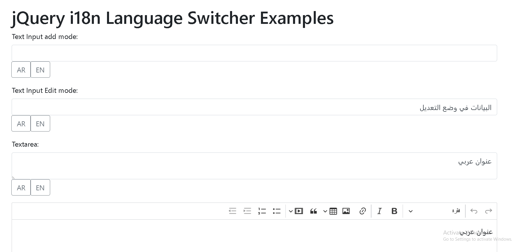

# jQuery i18n Language Switcher

This jQuery plugin offers an easy way to add multilingual support to input fields in a web form, including rich text fields using CKEditor.

## Features

- Multilingual support for text and textarea input fields
- Integration with CKEditor 5 for rich text editing
- Language switcher buttons for user selection
- Text alignment and direction adaptation for RTL and LTR languages
- Utilizes browser's locale if specific locales aren't defined
- support the edit mode
- compatible with bootstrap 

## Getting Started

To integrate the jQuery i18n Language Switcher, follow the instructions below.

### Prerequisites

- [jQuery](https://jquery.com/)
- [CKEditor](https://ckeditor.com/) (optional for rich text editing)

### Installation

1. Include the jQuery i18n script in your HTML file after including jQuery:

```html
<script src="https://code.jquery.com/jquery-3.6.0.min.js"></script>
<script src="path/to/jquery.i18n.js"></script>
```
2. Call the i18n function on the desired input element with the required configuration:
```javascript
$('input-selector').i18n({
    attribute: 'name', // custom attribute name (default is 'name')
});
```
3. You can also customize the locales by adding the data-i18n attribute to the HTML elements:

```html
<input type="text" data-i18n="en,ar" class="i18n-input" />
```
Customizing CKEditor
If the input has a class of 'ckeditor', the plugin will initialize CKEditor on that input. Ensure that the CKEditor script is included in your project for this to work.

License
This project can be licensed as required by your needs or organization.

Note: Ensure that you have the necessary dependencies included in your project, and consult the code documentation for further details on advanced usage.

Feel free to modify or expand this structure as per your project requirements or specific details!



